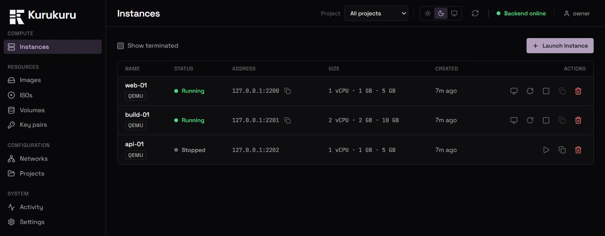

# Kurukuru

A local cloud platform for a single machine. It gives you an HTTP API and a web
dashboard for the whole VM lifecycle — provision, start, stop, terminate — on
top of QEMU, with a disk image catalog, cloud-init provisioning, a browser
console, and sizing bounded by what the host can actually spare. It is aimed at
people who want EC2-shaped workflows (launch by API, pick a size, get an SSH
command back) without a cloud account or a hypervisor GUI.



## What works today

### Platform support

| Platform | Status |
|---|---|
| **Windows 11** + Windows Hypervisor Platform | Validated. The reference platform |
| **Ubuntu 24.04** (software emulation) | Validated: install, full VM lifecycle, SSH, console, ISO boot, image import, the CLI, and the test suite all pass |
| **Ubuntu 24.04** + KVM | **Untested.** The code selects KVM and `-cpu host`, and neither has ever run |
| **macOS / HVF** | **Untested.** Code paths exist; nobody has run them |

The Linux validation ran on a host with no hardware virtualization available
(a cloud guest without nested virt), so everything there ran under TCG software
emulation — boots take minutes rather than seconds. That is a property of the
test host, not of Linux. What it means in practice is that the KVM-specific
choices are still unexercised: **acceleration under `/dev/kvm`, `-cpu host`,
and whether the console renders on the default `std` display under KVM.**

What that run did settle, and what it found — including three defects that were
never platform-specific and had survived nine phases on a developer machine —
is in [docs/PORTABILITY.md](docs/PORTABILITY.md).

- **VM lifecycle over HTTP** — `POST /instances` returns 202 immediately and
  provisions in the background; start, stop and terminate follow.
- **Custom sizing, capacity-aware** — CPUs, memory and disk are per-instance
  numbers. Presets (small/medium/large) fill them in. Requests are checked
  against *allocatable* capacity and refused with the arithmetic if they exceed
  it.
- **Cloud-init provisioning** — the orchestrator's SSH key is injected into
  cloud images through a NoCloud seed ISO, so a new instance is SSH-ready.
- **Browser console** — noVNC over a WebSocket bridge in the backend. No
  websockify process.
- **ISO boot** — install an arbitrary OS from an ISO onto a blank disk, through
  the console.
- **Image catalog** — register local qcow2/raw/vmdk/vdi files and launch from
  them. Instance disks are copy-on-write overlays, so a new VM costs megabytes,
  not gigabytes.
- **Reconciliation** — the database holds desired state; a background pass folds
  actual hypervisor state back in, so out-of-band changes show up.
- **A command-line client** — `kurukuru launch`, `ls`, `ssh`, `rm`, `doctor`, with
  `--json` on every read command and a documented exit-code table. See below.
- **SSH key pairs** — import your own or generate one, and choose which go on an
  instance. The orchestrator's key remains the default.
- **Custom user-data** — supply your own cloud-config; it is merged with the
  generated one rather than replacing it, so you keep your login.
- **Snapshots** — capture a stopped instance's disk and restore it later.
- **Port forwards** — expose any guest port on a host port, added and removed
  live on a running instance.
- **Volumes** — extra disks that outlive the instances they attach to.
  Terminating a VM detaches its volumes and keeps the data.
- **Instance detail view** — one page per instance: access, key pairs,
  snapshots, the user-data it was built with, and what has happened to it.
- **Projects** — group instances, images and key pairs so the dashboard is not
  one flat list. Organisational only: there is no auth, so a project filters a
  view and is never an access boundary.
- **Event log** — an append-only history per instance and across the install.
  Records what the rows cannot: every stop and start rather than the last one,
  every error rather than the most recent, restores (which change no row at
  all), and corrections the reconciler made on its own.

Not built: authorization and roles, multi-host, golden-image capture from a running VM,
bridged and host-only networking (both need elevation or a component this
project does not ship — see DECISIONS #24), live resize, UEFI boot (the
mechanism is measured and the design settled — see DECISIONS #42 — but nothing
consumes it). Snapshots — of an instance or of a volume — require the instance
to be stopped; see [DECISIONS #15](docs/DECISIONS.md) for the measurements
behind that. See [Project status](#project-status).

### Authentication

Every route requires a credential; the exceptions are `/health` and the login
flow, and a test enumerates the application's routes and fails if any other one
answers something other than 401 to an anonymous caller.

```
kurukuru auth init          # once, on the host: creates the owner account
kurukuru auth login         # stores an API token for this machine
kurukuru auth whoami
kurukuru auth token ls|create|rm
```

The browser signs in with a password and gets an httpOnly session cookie plus a
CSRF token. The CLI uses a long-lived API token, kept in a file locked to your
OS user. The console is opened with a single-use ticket bound to one instance
and to the session that minted it.

Creating the first account is a **host-local** operation rather than an HTTP
route, because a public route for it would hand ownership of every VM to
whoever called it first. Requiring filesystem access to the state directory is
strictly stronger — that directory already holds the SSH private key and every
VM disk.

What this does and does not protect, and how to recover a forgotten password,
is in [docs/SECURITY.md](docs/SECURITY.md).

## Requirements

| Component | Version | Notes |
|---|---|---|
| Python | 3.11+ | Tested on 3.13.7 (Windows) and 3.12.3 (Ubuntu 24.04) |
| Node.js | 18+ | Tested on 24.15.0. Only needed for the dashboard |
| QEMU | 8.0+ | Tested on 11.1.0 (Windows) and 8.2.2 (Ubuntu) |
| Accelerator | WHPX on Windows · KVM on Linux · HVF on macOS | Optional but strongly wanted; without it VMs fall back to software emulation and boot roughly 30× slower |

`qemu-system-x86_64` and `qemu-img` must be on `PATH`, or pointed at explicitly
(see [Configuration](#configuration)).

**Linux prerequisites.** Ubuntu ships none of these by default, and the venv
step fails confusingly without the first:

```bash
sudo apt install python3.12-venv qemu-system-x86 qemu-utils
```

On Fedora/RHEL that is `qemu-kvm` and `qemu-img`; on Arch, `qemu-full`. To use
KVM, the account running the backend must be able to read `/dev/kvm` — add it
to the `kvm` group and log back in. `kurukuru doctor` reports which accelerator was
selected and why.

**Disk:** the Ubuntu base image is ~600 MB, downloaded once on first QEMU
launch. Each instance adds a sparse overlay — a few hundred MB in practice, but
it can grow to the disk size you asked for. Budget a few GB.

**Memory:** 2 GB is held back for the host by default; whatever remains is what
instances can be given.

### Enabling Windows Hypervisor Platform

```powershell
# Elevated PowerShell. Requires a reboot.
Enable-WindowsOptionalFeature -Online -FeatureName HypervisorPlatform -All
```

## Command line

If you live in a terminal, the CLI is the primary interface — the dashboard is
the optional part. Installing the backend as an editable package puts `kurukuru` on
`PATH`:

```bash
pip install -e backend
kurukuru doctor          # checks QEMU, the accelerator, disk, keys — with remedies
kurukuru serve           # run the backend in the foreground
```

```bash
kurukuru launch web-01 --preset small --wait
kurukuru ls
kurukuru ssh web-01 -- uname -a
kurukuru rm web-01 --yes
```

```
NAME    STATUS   ADDRESS         SIZE      SOURCE                    AGE
web-01  Running  127.0.0.1:2200  1c/1G/5G  Ubuntu 24.04 LTS (cloud)  41s
web-02  Running  127.0.0.1:2201  2c/2G/8G  Ubuntu 24.04 LTS (cloud)  18s
```

It is an API client — the same HTTP API the dashboard uses, no privileged path
of its own. `--json` on every read command emits parseable JSON and nothing
else (progress goes to stderr), exit codes distinguish *not found* from
*conflict* from *timed out*, and nothing prompts when stdout is not a terminal.

Full reference: [docs/CLI.md](docs/CLI.md).

## Quickstart

### Backend

```powershell
# PowerShell
cd backend
python -m venv .venv
.\.venv\Scripts\Activate.ps1
pip install -r requirements.txt
uvicorn app.main:app --reload --port 8000
```

```bash
# bash / zsh
cd backend
python3 -m venv .venv           # Ubuntu ships no bare `python`; see prerequisites
source .venv/bin/activate       # Windows Git Bash: source .venv/Scripts/activate
pip install -r requirements.txt
uvicorn app.main:app --reload --port 8000
```

The API is then on <http://localhost:8000>, with interactive docs at
<http://localhost:8000/docs>.

### Frontend

In a second terminal:

```powershell
cd frontend
npm install
npm run dev
```

The dashboard is on <http://localhost:5173>.

### Configuration

Every setting is overridable by environment variable with an `KURUKURU_` prefix, or
by a `.env` file in `backend/`. Copy the annotated template:

```powershell
cp backend/.env.example backend/.env
```

Three things worth knowing about how `.env` is read:

- The prefix is `KURUKURU_`, uppercased — `qemu_dir` becomes `KURUKURU_QEMU_DIR`.
- The file is decoded as `utf-8-sig`, so a UTF-8 BOM (which Windows editors like
  to add) is tolerated.
- Unknown keys are **ignored**, not rejected. Leaving a stale setting behind is
  harmless, but a typo will also be silently ignored — if an override seems to
  have no effect, check the spelling first.

## First launch

1. Open <http://localhost:5173>. The header shows whether the backend is
   reachable.
2. Click **Launch Instance**. Pick **Quick launch**, give it a name
   (lowercase letters, digits and hyphens; must start with a letter), and pick a
   size. The **Size** row shows live host capacity.
3. Click **Launch**. The row appears as `Pending`, then `Provisioning`, then
   `Running` — typically about 30 seconds with hardware acceleration. The first
   launch on a fresh install is slower because it downloads the base image.
4. **To SSH in:** click the copy icon next to the instance's address. That copies
   a complete command including `-i` and the orchestrator's private key:

   ```
   ssh -i "C:\Users\you\.kurukuru\keys\id_ed25519" -p 2200 iaas@127.0.0.1
   ```

   Paste it into any terminal. QEMU guests are reached through a loopback port
   forward, which is why the port is part of the address.

5. **To use the console:** click **Console** on a running instance. This is the
   only way into ISO instances and images without cloud-init, which get no SSH
   key.

To install an OS from an ISO: drop a `.iso` into `~/.kurukuru/isos/`, then
choose **Install from ISO** in the launch dialog and pick it from the list.

## Troubleshooting

Each of these is a failure that actually happened during development.

### `HypervisorUnavailableError` / "QEMU binary not found"

`qemu-system-x86_64` is not on `PATH`. Either add it, or point at it directly:

```powershell
$env:KURUKURU_QEMU_SYSTEM_BINARY = "C:\Program Files\qemu\qemu-system-x86_64.exe"
$env:KURUKURU_QEMU_IMG_BINARY    = "C:\Program Files\qemu\qemu-img.exe"
```

`GET /health` reports the engine's own view, including the detected version —
check there first.

### `python -m venv .venv` fails with an `ensurepip` error

Same message, two completely different causes — check which platform you are on
before chasing the wrong one.

**On Linux**, the `python3-venv` package is missing and the error says so:
`apt install python3.12-venv`. (Also note `python` does not exist on Ubuntu —
use `python3`.)

**On Windows**, the checkout is too deep. The 260-character path limit bites
during venv creation, and the error names `ensurepip` rather than the real
cause. Clone somewhere shorter (`C:\src\kurukuru`), or enable long paths:

```powershell
# Elevated PowerShell.
Set-ItemProperty 'HKLM:\SYSTEM\CurrentControlSet\Control\FileSystem' `
  -Name LongPathsEnabled -Value 1
```

### VMs are extremely slow to boot

Hardware acceleration is not active, so QEMU is emulating in software. Run
`kurukuru doctor`, or check `GET /health`: `accel` will read `tcg` rather than
`whpx`/`kvm`/`hvf`.

- **Windows:** enable Windows Hypervisor Platform (above) and reboot.
- **Linux:** confirm `/dev/kvm` exists and that you can read it — if it is
  missing, the host has no virtualization support, it is disabled in
  firmware, or the machine is itself a VM without nested virt. If it exists but
  is unreadable, add your account to the `kvm` group and log back in.

For scale: a cloud image boots in ~23 s accelerated, and 4–5 minutes emulated on
a 2-core host. If you are stuck on software emulation, raise
`KURUKURU_QEMU_SHUTDOWN_TIMEOUT_SECONDS` too — a graceful stop was measured at 89 s
against the 90 s default, and exceeding it force-kills a guest mid-shutdown.

### The console is black on a cloud image

This is expected on standard graphics with hardware acceleration, and it is not
a bug in the console. QEMU's VGA emulation depends on memory dirty-tracking that
WHPX does not provide, so a guest that stays in **VGA text mode** — notably the
Ubuntu cloud image, which never binds a display driver — renders nothing.

Guests that switch to a framebuffer (any ISO installer worth the name) are
unaffected and render fine.

The fix is to launch with **Modern graphics** (`display: "virtio"`), under
*Advanced* in the launch dialog. The instance row's Console tooltip says this
too. Software emulation also works, but costs far more.

### A launch is refused with a 422 about capacity

The request exceeded what the host can currently allocate. The message contains
the arithmetic, for example:

```
Requested 60000 MB but only 13780 MB allocatable
(2048 MB host reserve, 0 MB committed to running instances).
```

Stop or terminate an instance to free the commitment, ask for less, or lower
`KURUKURU_HOST_RESERVE_MEMORY_BYTES` if you genuinely want to cut into the host's
share. `GET /host/capacity` shows the same numbers.

### An instance is Running but shows no address, marked Degraded

The VM booted but never published an IP after 90 seconds. Usually cloud-init
failed or the guest's network did not come up. Open the console to look, or read
the guest's serial log at:

```
~/.kurukuru/qemu/instances/<name>/qemu.log
```

### Where logs live

- **Backend:** stdout of the `uvicorn` process.
- **Guest serial console:** `~/.kurukuru/qemu/instances/<name>/qemu.log`
- **QEMU's own stderr:** `~/.kurukuru/qemu/instances/<name>/qemu-process.log` —
  this is where a VM that dies instantly explains itself.
- **Instance runtime state:** `~/.kurukuru/qemu/instances/<name>/runtime.json`
  (pinned ports, pid, accelerator, display).

## Project status

Early, and honest about it. It runs real VMs and has been used to do real work,
but:

- **Single host.** No clustering, no remote hypervisors.
- **No authorization.** There *is* authentication — every route requires it —
  but every account is equal. Projects organise resources without isolating
  them, and a second account is a second full administrator, not a restricted
  user.
- **No transport encryption.** Plain HTTP: on loopback that is fine, and beyond
  it means credentials and VM framebuffers cross the wire in the clear. Put a
  reverse proxy in front of it and terminate TLS there. See
  [docs/SECURITY.md](docs/SECURITY.md).
- **Windows-validated only.** Other platforms are unexercised. (That is the
  *host*. Windows **guests** are a separate matter — see below.)
- **Linux guests only, in practice.** Windows guests get the right virtual
  hardware and boot their installer, but no Windows install has ever completed.
  Treat Windows support as in progress, not available.
  See [Windows guests](#windows-guests).
- **SQLite, single process.** Fine for one machine; not a multi-writer design.

### Windows guests

**In progress, and not usable yet — no Windows install has ever completed on
this project.** A Windows instance launches, gets the right virtual hardware,
boots its installer, and can be driven through Setup as far as choosing a disk.
The install phase past that point has never finished.

What is established, each verified against a running installer rather than
inferred:

- **The device profile is right.** Windows guests get an AHCI/SATA disk
  (`ich9-ahci` + `ide-hd`), an Intel `e1000e` NIC and standard VGA. Setup's disk
  page lists the drive with **no "Load driver" step** — the whole reason for
  choosing AHCI over virtio.
- **Setup boots and can be driven** through every screen to disk selection.
- **Console input needs USB HID.** A QMP keystroke never reaches a PS/2 keyboard
  with no display client attached; Windows guests now get `qemu-xhci` +
  `usb-kbd` + `usb-tablet`.
- **Windows 11 is out of reach on a Windows host, permanently.** It requires TPM
  2.0, and QEMU excludes TPM emulation on Windows hosts at build time, so no
  upgrade adds it. Server and Windows 10 are unaffected.

The leading suspect for the remaining failure is the **VNC console** the engine
attaches to every VM, which is measurably ruinous under this host's accelerator
— identical command lines reach Setup in 21 s without it and never with it. That
is not yet proven to explain the install-phase stall, and it puts the feature in
direct conflict with its own access path, since Windows guests have no SSH.

**A warning for anyone measuring here:** this host is bimodal — the same command
line either succeeds in seconds or not at all — and three separate hypotheses in
this phase were confirmed and then retracted because of it. Use
`tools/ab_measure.py`, which alternates arms and refuses to draw a comparison
from fewer than three runs each.

Full status, evidence, eliminated hypotheses and the console options:
[docs/WINDOWS.md](docs/WINDOWS.md).

### Known gaps, deliberately deferred

Raised in review, understood, and not done yet. Listed here rather than left in
a comment thread, because a known gap that is not written down is
indistinguishable from one nobody noticed.

- **Reconciling is hard to reach.** Reconciliation is the mechanism that makes
  the dashboard agree with the hypervisor, and it is still a single icon in the
  header that reconciles *everything* — there is no way to ask for one
  instance. What it found is now reported rather than guessed at, the
  in-progress state says so in words, and the background poll pauses while a
  manual reconcile runs so the table cannot change underneath it for an
  unrelated reason. A success message still fades after four seconds; an error
  stays until dismissed. Per-instance reconcile is the part still missing.

Guest-facing surfaces are bound to `127.0.0.1` by design — VNC, QMP and the SSH
port forward — so the console proxy is the only path to a VM's screen. That is a
deliberate invariant with a test guarding it, not an accident of configuration.

### Non-goals

Not a VirtualBox or VMware replacement, not a container runtime, not a
multi-tenant cloud. The target is a single-machine platform with cloud-shaped
ergonomics.

## Documentation

- [Architecture](docs/ARCHITECTURE.md) — layering, state machine, reconciler,
  QEMU specifics, and how to add an engine.
- [API reference](docs/API.md) — every endpoint, generated against the live
  OpenAPI schema.
- [CLI reference](docs/CLI.md) — install, configuration, every command, the
  exit-code table and the scripting contract.
- [Portability](docs/PORTABILITY.md) — where the code assumed Windows, what was
  fixed, and what a Linux host still has to confirm.
- [Windows guests](docs/WINDOWS.md) — status: what is established, what is
  eliminated with evidence, and why no result here is believable from a single
  run.
- [Tools](tools/README.md) — the media checker and the alternating-runs
  measurement harness, and the mistakes that made each necessary.
- [Security](docs/SECURITY.md) — the threat model, what is deliberately not
  protected, and how to recover a password or revoke a token.
- [Decisions](docs/DECISIONS.md) — why things are the way they are.
- [Contributing](CONTRIBUTING.md) — running the tests and the conventions in use.
- [History](docs/history/) — the phase briefs this was built from.

## License

**TODO — not yet chosen.** Until a license is added, no permission to use, copy
or redistribute is granted.

QEMU is invoked as a separate process via its command line; no QEMU code is
linked into this project. That keeps QEMU's GPL obligations at the process
boundary, the same posture UTM and Podman take. This note is a description of
the technical arrangement, not legal advice.
